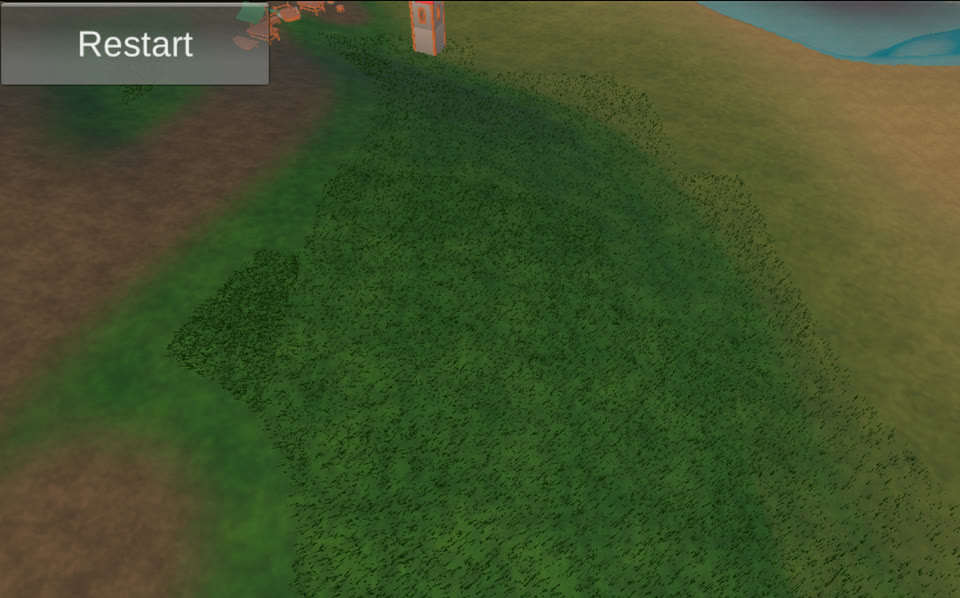

# AI-PG2-Assignment · 程序化生成迷你开放世界

用**程序化生成（PCG）+ 行为树 AI** 搭建的俯视漫游小游戏世界：噪声地形、自动选址的聚落与道路、按行为树生活的 NPC 与动物。

## 玩法与操作

魔兽式 RTS 相机漫游 + 观察模拟世界：

- **相机**：屏幕边缘滚动 / WASD 移动、滚轮缩放、Q / E 旋转
- **交互**：左键选择 NPC（选中光圈），右键下达命令——点 NPC 闲聊、点动物互动、点车辆上车、点地面移动
- 无胜负条件，观察小镇里的 NPC 与动物按各自的行为树生活

## 技术亮点

- **PCG 地形**：值噪声 + fBm / Ridge、百分位高度分带、聚落拒绝采样选址、绕湖避雪的道路生成、GPU 草地、湖面顶点色、NavMesh 自动烘焙（详见 [Assets/Docs/README_PCG.md](Assets/Docs/README_PCG.md)，含 14.1s → 6.0s 的生成优化记录）
- **行为树 AI**：Sequence / Selector / TimeLimit 组合节点；NPC 分居民 / 探索者 / 司机三类——司机找车在城镇间往返，动物按地表分布（吃草 / 逃跑 / 跟随）；车辆系统会避让行人
- **自写 ECS**：统一驱动地形、AI 与昼夜循环（双平行光模拟日月）
- **自定义 URP Shader**：LowPolyTerrain / GrassURP / WaterURP / SelectionMarkerURP
- 建筑使用 Kenney Fantasy Town Kit + 自写 BuildingAssembler 编辑器工具

## 运行

- **WebGL**：`Build/index.html`（需经本地 HTTP 服务器打开，且服务器需为 `.gz` 响应附加 `Content-Encoding: gzip` 头）
- **编辑器**：Unity 6000.0.68f1 打开仓库根目录，打开主场景运行

更多开发总结见 [Assets/Docs/系统总结.md](Assets/Docs/系统总结.md)。

## License

[MIT](./LICENSE)
